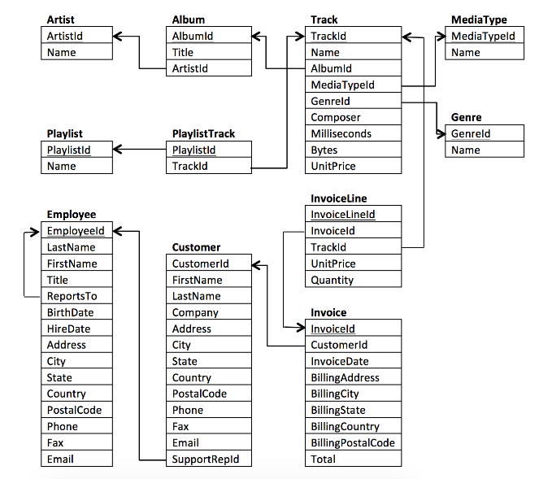

# Easy-Level SQL Questions

💡 **Reminder**: The database schema is provided at the end of this md file. 

---

## Question 1: Which countries have the most Invoices? 

**Brief Explanation:** This SQL query groups customers by country and counts the number of invoices for each country, presenting the results in descending order of invoice counts.
### SQL Query:

```sql
SELECT c.Country, COUNT(i.InvoiceId) Invoices
FROM Customer c NATURAL JOIN Invoice i
GROUP BY 1
ORDER BY 2 DESC;

```

### Results


---

## Question 2: Which are the top 10 cities with the highest-spending customers?

**Brief Explanation:** This SQL query groups customers by city and calculates the total spending per city, presenting the results in descending order of total spending.

### SQL Query:
```sql
SELECT c.City, SUM(i.Total) total_spent
FROM Customer c NATURAL JOIN Invoice i
GROUP BY 1
ORDER BY 2 DESC;
```
### Results


---
## Question 3: Who are the top 10 customers?

**Brief Explanation:** This SQL query calculates individual customer spending, by grouping results by customer ID and his full name to ensure uniqueness. Sorted by spending in descending order.

### SQL Query:
```sql
SELECT c.CustomerId,
       c.FirstName || ' ' ||c.LastName AS full_name,
       SUM(i.Total) total_spending
FROM Customer c NATURAL JOIN Invoice i
GROUP BY 1, 2
ORDER BY 3 DESC;
```
### Results


---
### Schema

