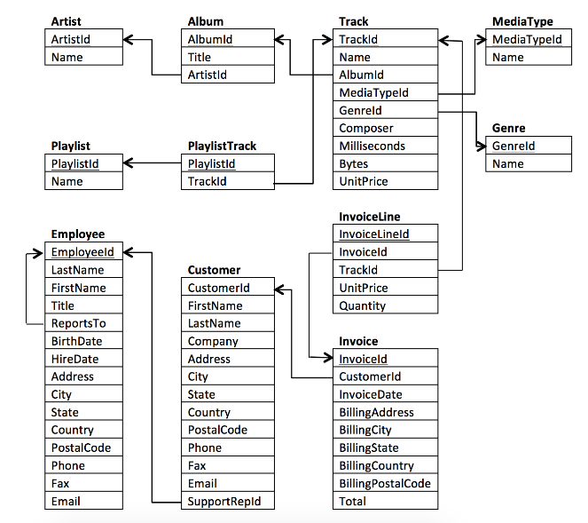

💡 **Reminder**: The database schema provided at the end of the md file. 

---

## Question 1: Who are the Rock music listeners?

> **Brief Explanation:** This SQL query retrieves unique Rock music listeners by joining multiple tables and using the `DISTINCT` keyword to eliminate duplicate providing a clean list of Rock music listeners.

### SQL Query

```sql
SELECT DISTINCT(c.Email), c.FirstName, 
	   c.LastName, g.Name genre
FROM Customer c NATURAL JOIN Invoice i
NATURAL JOIN InvoiceLine il
NATURAL JOIN Track t
JOIN Genre g ON t.GenreId = g.GenreId
WHERE genre == 'Rock'
ORDER BY 1;
```

### Results

|Email|First Name|Last Name|Genre|
|---|---|---|---|
|[aaronmitchell@yahoo.ca](mailto:aaronmitchell@yahoo.ca)|Aaron|Mitchell|Rock|
|[alero@uol.com.br](mailto:alero@uol.com.br)|Alexandre|Rocha|Rock|
|[astrid.gruber@apple.at](mailto:astrid.gruber@apple.at)|Astrid|Gruber|Rock|
|[bjorn.hansen@yahoo.no](mailto:bjorn.hansen@yahoo.no)|Bjørn|Hansen|Rock|
|[camille.bernard@yahoo.fr](mailto:camille.bernard@yahoo.fr)|Camille|Bernard|Rock|

---

## Question 2: Who are the top Rock bands by number of songs?

> **Brief Explanation:** This SQL query identifies the top Rock bands with the highest song counts. It utilizes joins and grouping to calculate the song count for each band.

### SQL Query

```sql
SELECT a.ArtistId, a.Name Artist_name, 
	   g.Name genre_name, COUNT(*) Number_of_songs
FROM Artist a NATURAL JOIN Album al
JOIN Track t ON al.AlbumId = t.AlbumId
JOIN Genre g ON t.GenreId = g.GenreId
WHERE g.Name == 'Rock'
GROUP BY 1, 2
ORDER BY 4 DESC;
```

### Results

|ArtistId|Name|genre_name|Number_of_songs|
|---|---|---|---|
|22|Led Zeppelin|Rock|114|
|150|U2|Rock|112|
|58|Deep Purple|Rock|92|
|90|Iron Maiden|Rock|81|
|118|Pearl Jam|Rock|54|

---
## Question 3: Retrieve track names for songs with durations surpassing the average song length.

>**Brief Explanation:** This SQL query begins by calculating the average duration of all songs using a nested subquery. It then filters the tracks, retaining only those with durations greater than this calculated average.

### SQL Query

```sql
SELECT Name Track_name, Milliseconds FROM Track
WHERE Milliseconds > (
	/* Getting the average duration of all tracks*/
    SELECT AVG(Milliseconds)
    FROM Track
)
ORDER BY 2 DESC;
```

### Results

|Track_name|Milliseconds|
|---|---|
|Through the Looking Glass|5088830|
|Occupation|5086636|
|Winds of Time|5084774|
|Somethin' Special|5084423|
|Baby's Arms|5083461|

---

### Schema

